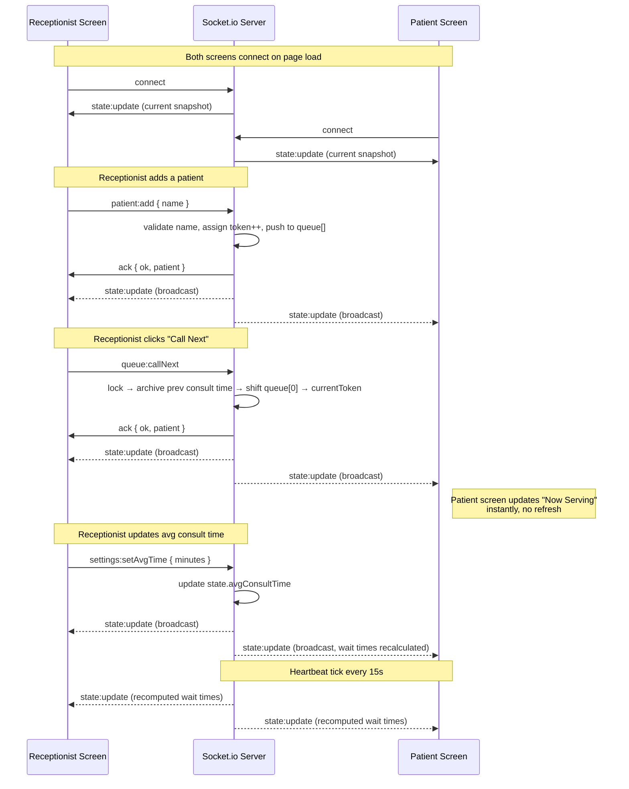

# Socket Event Diagram — Queue Cure '26

## Architecture

```
┌─────────────────────┐                         ┌─────────────────────┐
│  Receptionist Screen │                         │   Patient Screen     │
│  (receptionist.html) │                         │   (patient.html)     │
└──────────┬───────────┘                         └──────────┬───────────┘
           │  socket.io client                              │ socket.io client
           │                                                 │
           ▼                                                 ▼
        ┌───────────────────────────────────────────────────────┐
        │              Node.js + Express + Socket.io             │
        │                     server.js (single                  │
        │                  in-memory state object)               │
        └───────────────────────────────────────────────────────┘
```

Both screens are just two browser tabs connected to the SAME Socket.io
server. The server holds the only "truth" (the queue array + current
token). Any client action mutates that truth, then the server
broadcasts the new state to EVERY connected client — receptionist and
patient screens alike. Neither screen ever trusts its own local copy
of the queue for writes; they only display what the server sends back.

## Event Flow Diagram (Mermaid)



## Event Reference Table

| Event Name             | Direction         | Payload                          | Purpose |
|-------------------------|--------------------|-----------------------------------|---------|
| `connect`              | client → server   | —                                  | New screen opens / reconnects |
| `state:update`         | server → ALL      | `{ currentToken, queue[], avgConsultTime, queueLength, serverTime }` | Single broadcast event both screens render from |
| `patient:add`          | Receptionist → server | `{ name }` + ack callback     | Add new patient, get back assigned token |
| `queue:callNext`       | Receptionist → server | `null` + ack callback         | Advance queue, set new currentToken |
| `settings:setAvgTime`  | Receptionist → server | `{ minutes }` + ack callback  | Update avg consult time used in wait math |
| `patient:remove`       | Receptionist → server | `{ token }` + ack callback    | Mistake-proofing: undo accidental add |
| `queue:reset`          | Receptionist → server | `null` + ack callback         | Clear queue for a new day |
| `disconnect`           | client → server   | —                                  | Screen closed / network drop |

## Why a single `state:update` broadcast (not many granular events)?

We deliberately use **one fat event** instead of separate events like
`patient:added`, `token:called`, `avgTime:changed` for the *outgoing*
broadcast. Reasons:

1. **No missed-event bugs.** If a patient screen briefly disconnects and
   reconnects, it gets a fresh full snapshot on `connect` — no need to
   replay a history of granular events to reconstruct state.
2. **No ordering bugs.** Granular events can arrive out of order under
   poor network conditions; a full-state snapshot is idempotent — the
   client always just "renders whatever it's given," last-write-wins.
3. **Simplicity for a 1-day hackathon.** Less surface area for sync
   bugs = more time for polish (which is 40% of the grade).

Mutating actions (`patient:add`, `queue:callNext`, etc.) are still sent
as distinct named events **with ack callbacks**, so the sender gets
immediate success/failure feedback (e.g. "Queue is empty") even though
the resulting state change is broadcast generically.
