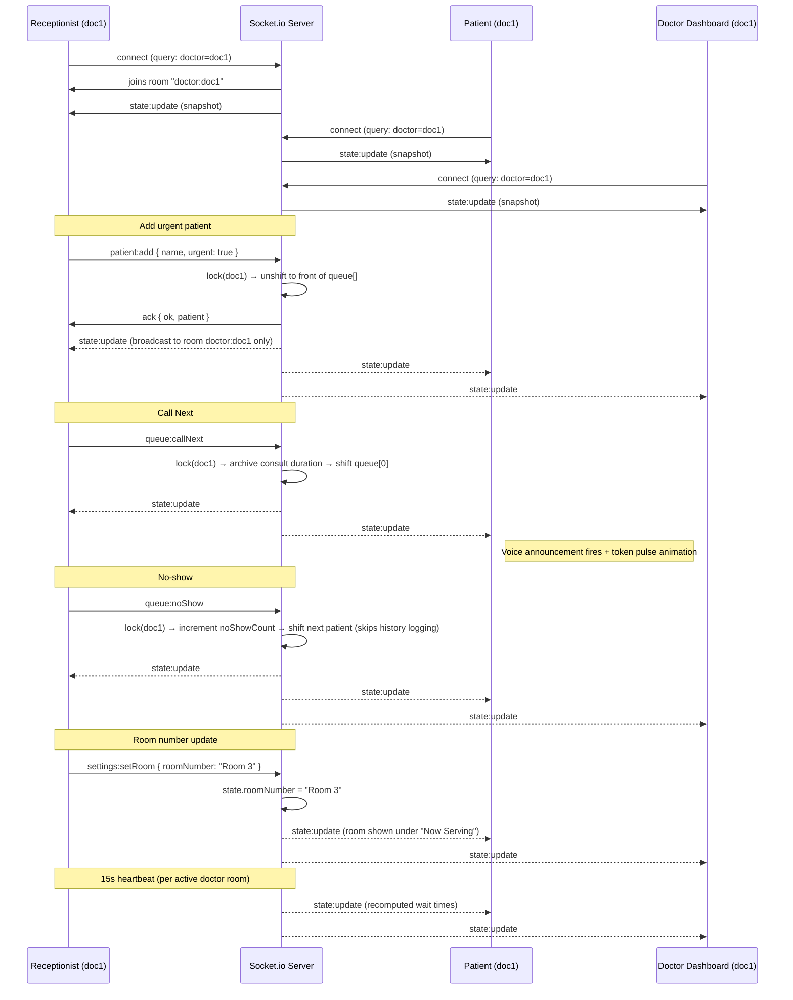

# Socket Event Diagram — Queue Cure '26 (Final)

## Architecture — multi-doctor rooms

Each browser tab connects to the Socket.io server with a `doctor` query
param (`?doctor=doc1`). The server places that socket into a Socket.io
**room** named `doctor:<id>`, and every broadcast is scoped to that
room only — so doc1's events never reach doc2's screens, and vice versa.

Receptionist (doc1) ─┐                      Receptionist (doc2) ─┐

Patient (doc1)       ─┼──► room "doctor:doc1"  Patient (doc2)    ─┼──► room "doctor:doc2"

Doctor Dash (doc1)   ─┘         │              Doctor Dash (doc2) ─┘         │

▼                                          ▼

stateByDoctor["doc1"]                    stateByDoctor["doc2"]

(independent in-memory state, independent lock)

## Event Flow (Mermaid)

## Full Event Reference

| Event Name             | Direction         | Payload                          | Scope |
|--------------------------|--------------------|-------------------------------------|---------|
| `connect`                | client → server   | query: `{ doctor }`                 | Joins room `doctor:<id>` |
| `state:update`           | server → room      | `{ doctorId, roomNumber, currentToken, queue[], avgConsultTime, queueLength, totalSeenToday, noShowCount, serverTime }` | Broadcast to one doctor's room only |
| `patient:add`            | client → server   | `{ name, urgent }` + ack            | Per-doctor lock |
| `queue:callNext`         | client → server   | `null` + ack                        | Per-doctor lock |
| `queue:noShow`           | client → server   | `null` + ack                        | Per-doctor lock; skips history logging to protect real wait-time accuracy |
| `settings:setAvgTime`    | client → server   | `{ minutes }` + ack                 | Per-doctor |
| `settings:setRoom`       | client → server   | `{ roomNumber }` + ack              | Per-doctor |
| `patient:remove`         | client → server   | `{ token }` + ack                   | Per-doctor |
| `queue:reset`            | client → server   | `null` + ack                        | Per-doctor — resets only that doctor's room |
| `disconnect`             | client → server   | —                                    | Leaves room automatically |

## Why per-doctor rooms instead of one global broadcast?

Without rooms, every `state:update` would go to *every* connected
client regardless of doctor — doc2's receptionist would see doc1's
queue flicker on their screen too, and the client JS would need to
manually filter by `doctorId` on every render. Using Socket.io's
built-in **room** feature pushes that isolation down to the transport
layer itself: the server simply never sends doc1's data to a doc2
socket, so there's no risk of a client-side filtering bug leaking
queue data across counters — which matters for both correctness and
patient privacy (one doctor's queue shouldn't show another's patient
names).
